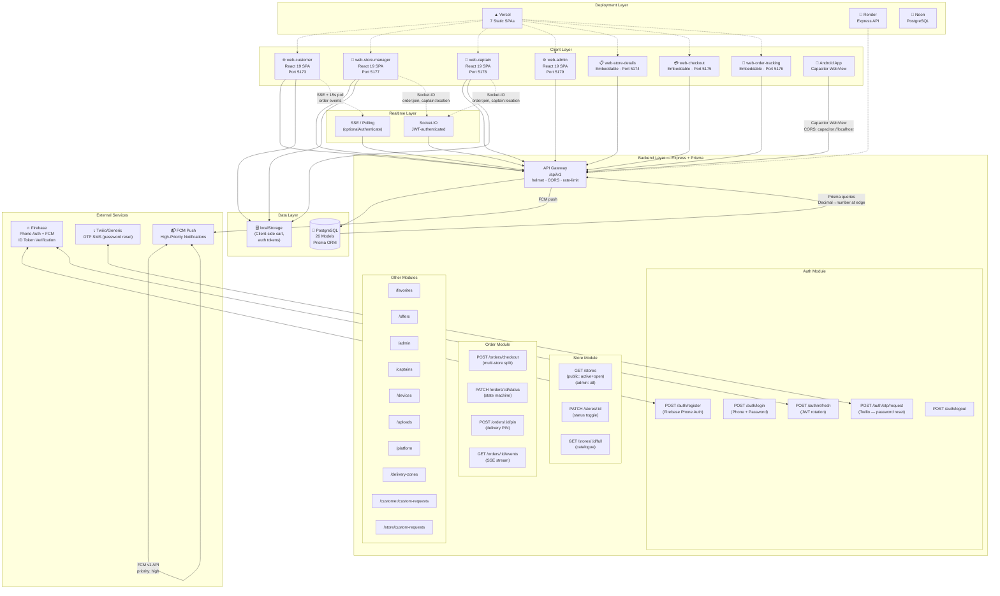

# Samou' Go — Production Architecture & Structure Map

## Project Overview

**Samou' Go** is a hyper-local delivery platform for Samou', Hebron, Palestine. Arabic-first RTL UI, emerald brand (`#10B981`), cash-on-delivery only. Multi-role: customers browse stores and place orders, store managers manage catalogues and fulfill orders, delivery captains pick up and deliver, admins oversee the entire platform.

**Tech Stack:**
- **Backend:** Express.js + Prisma ORM + PostgreSQL (Neon) / SQLite (dev)
- **Frontend:** React 19 + Vite + Tailwind v4 + TypeScript 5.7
- **Mobile:** Capacitor (Android), wrapping `web-customer` SPA
- **Realtime:** Socket.IO (JWT-authenticated) + SSE with 15s polling fallback
- **Auth:** JWT (access + rotating refresh tokens), Firebase Phone Auth (registration), OTP via Twilio/Generic (password reset)
- **Push:** Firebase Cloud Messaging (FCM) — high-priority notification channels
- **Storage:** Local disk upload pipeline (presign → PUT → finalize), processed webp with immutable caching
- **Deploy:** Vercel (7 SPAs), Render (API), Neon (PostgreSQL), GitHub Actions CI/CD
- **Scale:** Production-Ready & Scalable (multi-store, multi-role, multi-store cart split, delivery zones, wallet/settlement system)

---

## 1. Complete Directory & File Tree

```
samou-go/
├── .github/
│   └── workflows/
│       ├── ci.yml                          # CI: install → build → typecheck → test on push/PR
│       └── deploy.yml                      # CD: migrate → build → deploy to Vercel/Render
├── packages/
│   ├── shared-types/                       # Contract layer — enums, DTOs, state machines, delivery rules
│   │   ├── src/
│   │   │   ├── enums.ts                    # All enums (UserRole, OrderStatus, StoreStatus, StoreType…)
│   │   │   ├── models.ts                   # TypeScript interfaces for all DB models
│   │   │   ├── dto.ts                      # API request/response DTOs
│   │   │   ├── roles.ts                    # Role-based permission helpers
│   │   │   ├── delivery.ts                 # Delivery fee calculation (hard-zeroed currently)
│   │   │   ├── phone.ts                    # Phone normalization (+970/+972), WhatsApp link formatter
│   │   │   ├── index.ts                    # Barrel export
│   │   │   └── __tests__/                  # 99 domain tests (Vitest)
│   │   ├── package.json
│   │   └── tsconfig.json
│   │
│   ├── api/                                # Express REST API — port 4000
│   │   ├── src/
│   │   │   ├── server.ts                   # HTTP server bootstrap
│   │   │   ├── app.ts                      # Express app: helmet, CORS, static uploads, routes, errors
│   │   │   ├── realtime.ts                 # Socket.IO: JWT auth, rooms, event emitters
│   │   │   ├── realtime-handlers.ts        # Socket.IO event handlers (order:join, captain:location, chat:send)
│   │   │   ├── config/
│   │   │   │   ├── env.ts                  # Zod-validated env config, production guards
│   │   │   │   └── cors.ts                 # Origin allowlist (7 Vercel + dev ports + Capacitor)
│   │   │   ├── lib/
│   │   │   │   ├── async-handler.ts        # Wraps async route handlers to catch throws
│   │   │   │   ├── decimal.ts              # Decimal → number conversion at the API edge
│   │   │   │   ├── http-error.ts           # Typed HTTP error factories (badRequest, notFound, etc.)
│   │   │   │   ├── jwt.ts                  # Access/refresh token mint + verify
│   │   │   │   ├── order-number.ts         # Atomic daily order number: SG-YYMMDD-NNNN
│   │   │   │   ├── order-party.ts          # Order ownership/role checks
│   │   │   │   ├── password.ts             # bcrypt hash + verify
│   │   │   │   ├── prisma.ts               # Prisma client singleton + caseInsensitiveContains()
│   │   │   │   ├── push.ts                 # FCM push notification dispatch
│   │   │   │   ├── respond.ts              # ok/created/noContent response envelope
│   │   │   │   ├── validate.ts             # parseWith(zodSchema) request body parser
│   │   │   │   └── sms/                    # SMS dispatch: Twilio, Infobip, Generic, Console
│   │   │   ├── middleware/
│   │   │   │   ├── authenticate.ts         # JWT auth middleware (hard + optional gates)
│   │   │   │   ├── error-handler.ts        # Global error → HTTP envelope
│   │   │   │   ├── not-found.ts            # 404 catch-all
│   │   │   │   └── rate-limit.ts           # IP-based rate limiting
│   │   │   ├── modules/
│   │   │   │   ├── auth/                   # Registration, login, OTP, Firebase, refresh tokens
│   │   │   │   │   ├── auth.routes.ts
│   │   │   │   │   ├── auth.controller.ts
│   │   │   │   │   ├── auth.service.ts
│   │   │   │   │   ├── auth.mapper.ts
│   │   │   │   │   ├── auth.schemas.ts
│   │   │   │   │   ├── firebase.service.ts # Firebase ID token verification (real + mock)
│   │   │   │   │   ├── otp.service.ts      # OTP dispatch + verification (Twilio/Generic)
│   │   │   │   │   └── refresh-token.ts    # Token rotation + revocation
│   │   │   │   ├── stores/                 # Store CRUD, catalogue, status toggle
│   │   │   │   │   ├── stores.routes.ts
│   │   │   │   │   ├── stores.controller.ts
│   │   │   │   │   ├── stores.service.ts   # Visibility rules (admin/staff/public)
│   │   │   │   │   ├── stores.mapper.ts
│   │   │   │   │   └── stores.schemas.ts   # List query, create/update, storeType
│   │   │   │   ├── orders/                 # Order lifecycle, multi-store split, PIN, delivery fee
│   │   │   │   │   ├── orders.routes.ts
│   │   │   │   │   ├── orders.controller.ts
│   │   │   │   │   ├── orders.service.ts   # State machine enforcement, transactions
│   │   │   │   │   ├── orders.mapper.ts    # Prisma → DTO (Decimal→number)
│   │   │   │   │   ├── orders.schemas.ts
│   │   │   │   │   └── *.test.ts           # 4 test files: state machine, concurrency, delivered, SSE
│   │   │   │   ├── users/                  # Customer profile
│   │   │   │   ├── captains/               # Captain management, availability
│   │   │   │   ├── admin/                  # Admin-only endpoints
│   │   │   │   ├── favorites/              # Store heart-toggle
│   │   │   │   ├── offers/                 # Store promotional offers
│   │   │   │   ├── zones/                  # Delivery zones CRUD
│   │   │   │   ├── platform/               # PlatformSettings singleton (wallet, fees, WhatsApp number)
│   │   │   │   ├── devices/                # FCM device token registration
│   │   │   │   └── custom-requests/        # طلب خاص — customer ↔ store negotiation
│   │   │   ├── uploads/
│   │   │   │   ├── uploads.routes.ts       # Presign / finalize / remove
│   │   │   │   ├── uploads.service.ts      # Local disk pipeline, image processing
│   │   │   │   └── uploads.config.ts       # Upload directories + MIME validation
│   │   │   ├── routes/
│   │   │   │   └── index.ts               # API router: mounts all modules + /meta endpoint
│   │   │   ├── scripts/
│   │   │   │   └── seed.ts                 # Idempotent seed (password: samou1234)
│   │   │   ├── security/
│   │   │   │   └── security.integration.test.ts
│   │   │   └── types/
│   │   │       └── express.d.ts            # Request augmentation (req.user)
│   │   ├── prisma/
│   │   │   ├── schema.prisma               # Production PostgreSQL schema (26 models)
│   │   │   ├── schema.sqlite.prisma        # Local dev SQLite mirror
│   │   │   ├── dev.db                      # Local SQLite database
│   │   │   ├── migrations/                 # Migration files (prisma migrate deploy)
│   │   │   └── prisma.config.ts
│   │   ├── generated/                      # Prisma clients (postgres + sqlite)
│   │   └── package.json
│   │
│   ├── api-client/                         # Typed fetch + React hooks (browser-only, NO build step)
│   │   ├── src/
│   │   │   ├── api.ts                      # All API functions (getStores, listOrders, uploadImage…)
│   │   │   ├── useApi.ts                   # useResource, useMutation, useOrderEvent (SSE + polling)
│   │   │   ├── useAuth.ts                  # Auth context hook (login, logout, refresh, user state)
│   │   │   ├── useToast.ts                 # Toast notification hook
│   │   │   ├── realtime.ts                 # Socket.IO client wrapper
│   │   │   ├── compressImage.ts            # Canvas-based client-side image compression
│   │   │   ├── language.ts                 # Locale switching (ar/en)
│   │   │   ├── roles.ts                    # Role constants re-export
│   │   │   ├── sso.ts                      # SSO helpers
│   │   │   ├── SignInGate.tsx               # Auth gate component
│   │   │   ├── DarkModeToggle.tsx           # Theme toggle
│   │   │   ├── useDarkMode.ts              # Dark mode hook
│   │   │   └── index.ts                    # Barrel export
│   │   └── package.json
│   │
│   └── ui/                                 # Shared primitives across all 7 SPAs
│       ├── src/
│       │   ├── index.ts                    # Barrel export
│       │   ├── bootstrap.ts                # bootstrapApp(): light-mode lock, Framer Motion skip, broken-image
│       │   ├── chime.ts                    # Audio alert for new orders (JS-side, foreground only)
│       │   ├── components/
│       │   │   └── AppErrorBoundary.tsx     # Global error boundary
│       │   ├── lib/
│       │   │   └── store-display.ts        # classifyStore(): StoreType → display name + icon
│       │   ├── map/
│       │   │   └── DeliveryFeeMap.tsx       # Leaflet map with delivery zones
│       │   └── styles/
│       │       └── tokens.css              # Shared CSS custom properties
│       ├── dist/                           # Built output (gitignored, built on install)
│       └── package.json
│
├── themes/
│   ├── web-customer/                       # Main SPA — customer-facing (port 5173)
│   │   ├── src/
│   │   │   ├── main.tsx                    # React entry: Provider tree (AuthProvider → FavoritesProvider)
│   │   │   ├── App.tsx                     # React Router: /, /stores/:id, /cart, /checkout, /orders…
│   │   │   ├── screens/                    # 11 screen components (Auth, Cart, Checkout, Orders, etc.)
│   │   │   ├── components/
│   │   │   │   ├── generated/              # Auto-generated layout shells (SamouGoHome, ScreenShell…)
│   │   │   │   ├── CartProvider.tsx        # v2 localStorage cart with multi-store split
│   │   │   │   ├── FavoritesProvider.tsx    # Favorites context (auth-gated)
│   │   │   │   ├── BottomNav.tsx           # 4-tab bottom nav with active-order badge
│   │   │   │   └── SupportWhatsAppButton.tsx
│   │   │   ├── staff/                      # Lazy-loaded role dashboards within the same bundle
│   │   │   │   ├── store-manager/          # /store-manager/* routes
│   │   │   │   └── captain/                # /captain/* routes
│   │   │   ├── hooks/                      # useLocation, useToast, etc.
│   │   │   ├── contexts/                   # AuthContext, ThemeContext
│   │   │   ├── lib/                        # firebase.ts, delivery.ts, formatWhatsAppLink
│   │   │   └── theme/                      # Tailwind v4 tokens
│   │   ├── assets/icon.png                 # Source app icon
│   │   ├── android/                        # Capacitor Android project
│   │   │   └── app/src/main/
│   │   │       ├── AndroidManifest.xml     # POST_NOTIFICATIONS, Internet, camera
│   │   │       ├── java/.../MainActivity.java  # Notification channels (orders_high_priority)
│   │   │       └── res/
│   │   │           ├── raw/order_alarm.wav  # 10-second high-priority notification sound
│   │   │           ├── mipmap-*/           # App icons (all densities)
│   │   │           └── values/strings.xml
│   │   └── vite.config.ts
│   │
│   ├── web-admin/                          # Admin dashboard (port 5179)
│   │   └── src/
│   │       └── components/generated/
│   │           └── SamouGoAdminDashboard.tsx  # 2000+ line dashboard: stores, orders, captains, zones, settings
│   │
│   ├── web-store-manager/                  # Standalone store-manager SPA (port 5177)
│   │   └── src/components/generated/
│   │       └── SamouGoStoreManager.tsx
│   │
│   ├── web-captain/                        # Standalone captain SPA (port 5178)
│   │   └── src/components/generated/
│   │       └── SamouGoCaptain.tsx
│   │
│   ├── web-store-details/                  # Embeddable store detail (port 5174)
│   ├── web-checkout/                       # Embeddable checkout (port 5175)
│   └── web-order-tracking/                 # Embeddable order tracking (port 5176)
│
├── scripts/
│   └── e2e-smoke.mjs                       # E2E smoke test (needs running + seeded API)
├── To_Do_old_versions/                     # Historical docs, old DESIGN_SYSTEM.md
├── package.json                            # Root: workspaces, scripts, engine constraints
├── tsconfig.base.json                      # Shared TS config: strict, noUncheckedIndexedAccess
├── .gitignore
├── CLAUDE.md                               # Project context for AI agents
└── AGENTS.md                               # Condensed CLAUDE.md
```

---

## 2. System Architecture & Data Flow



---

## 3. Data Model & Entity Relations

### Core Entities (26 models)

```
┌─────────────────────────────────────────────────────────────────────┐
│                         ENTITY RELATIONSHIP MAP                     │
├─────────────────────────────────────────────────────────────────────┤
│                                                                     │
│  User (users)                                                       │
│  ├── id (PK, CUID)                                                 │
│  ├── name, phone (unique), passwordHash, role (enum: CUSTOMER/      │
│  │   STORE_MANAGER/CAPTAIN/ADMIN)                                   │
│  ├── isActive, isVerified (captains), isAvailable (captains)        │
│  ├── assignedStoreId? → Store (captain → dedicated store)           │
│  ├── profileImageUrl?, profileImageKey?                             │
│  ├── latitude?, longitude?                                          │
│  │                                                                  │
│  ├── 1:N → Store (managedStores, via managerId)                    │
│  ├── 1:N → Order (customerOrders, captainOrders)                   │
│  ├── 1:N → OrderStatusHistory (statusChanges)                      │
│  ├── 1:N → RefreshToken (refreshTokens)                            │
│  ├── 1:N → Favorite (favorites)                                    │
│  ├── 1:N → CustomRequest (customRequests)                          │
│  ├── 1:N → Rating (ratingsGiven, ratingsAsCaptain)                 │
│  ├── 1:N → ChatMessage                                             │
│  ├── 1:N → SupportTicket                                           │
│  ├── 1:1 → CaptainLocation?                                        │
│  ├── 1:1 → Wallet?                                                 │
│  └── 1:N → DeviceToken                                             │
│                                                                     │
│  Store (stores)                                                     │
│  ├── id (PK)                                                        │
│  ├── nameAr, nameEn, logoUrl?, coverUrl?, phone                     │
│  ├── isActive, isApproved, isRecommended, isAcceptingOrders         │
│  ├── storeStatus (enum: OPEN/BUSY/CLOSED)                           │
│  ├── storeType? (enum: RESTAURANT/CAFE/SUPERMARKET/STORE/           │
│  │   BAKERY_SWEETS/BUTCHERY/VEGETABLES_FRUITS)                      │
│  ├── openingTime?, closingTime?                                     │
│  ├── latitude?, longitude? (shopfront GPS)                          │
│  │                                                                  │
│  ├── N:1 → User (manager, via managerId)                           │
│  ├── 1:N → Category                                                │
│  ├── 1:N → Product                                                 │
│  ├── 1:N → Order                                                   │
│  ├── 1:N → Offer                                                   │
│  ├── 1:N → Favorite                                                │
│  ├── 1:N → User (dedicatedCaptains)                                │
│  ├── 1:N → Rating                                                  │
│  ├── 1:1 → Wallet?                                                 │
│  └── 1:N → CustomRequest                                           │
│                                                                     │
│  Order (orders)                                                     │
│  ├── id (PK), orderNumber (unique: SG-YYMMDD-NNNN)                 │
│  ├── customerId → User, storeId → Store, captainId? → User          │
│  ├── cartCheckoutId? (links multi-store sub-orders)                 │
│  ├── status (enum: PENDING→ACCEPTED→PREPARING→READY_FOR_PICKUP→    │
│  │   ON_THE_WAY→DELIVERED|CANCELLED)                                │
│  ├── customerAddressText, addressNote?, orderNote?, deliveryPreset?  │
│  ├── latitude?, longitude? (delivery pin GPS)                       │
│  ├── deliveryPin?, deliveryPinAttempts (rate-limited: 5 max)        │
│  ├── subtotal, deliveryFee, discount, totalAmount (Decimal 10,2)    │
│  ├── paymentMethod (COD only today), voucherId?, deliveryZoneId?     │
│  │                                                                  │
│  ├── 1:N → OrderItem (frozen prices at order time)                 │
│  ├── 1:N → OrderStatusHistory (append-only audit trail)            │
│  ├── 1:1 → Rating?                                                 │
│  └── 1:N → ChatMessage                                             │
│                                                                     │
│  Category → 1:N Product                                            │
│  Product → N:1 Category?, N:1 Store, 1:N OrderItem                 │
│  Offer → 1:N OfferProduct → N:1 Product                            │
│  DeliveryZone → 1:N Order                                          │
│  Voucher → 1:N Order                                               │
│  Wallet → 1:N LedgerEntry, 1:N Settlement                          │
│  CustomRequest → N:1 User (customer), N:1 Store                    │
│  PlatformSettings (singleton row, id='platform')                    │
│                                                                     │
└─────────────────────────────────────────────────────────────────────┘
```

### Enum Definitions (byte-identical across Prisma + shared-types)

| Enum | Values | Purpose |
|---|---|---|
| `UserRole` | CUSTOMER, STORE_MANAGER, CAPTAIN, ADMIN | Account role |
| `OrderStatus` | PENDING → ACCEPTED → PREPARING → READY_FOR_PICKUP → ON_THE_WAY → DELIVERED \| CANCELLED | Order lifecycle (state machine) |
| `PaymentMethod` | COD | Cash on delivery (only method today) |
| `StoreStatus` | OPEN, BUSY, CLOSED | Three-state store availability |
| `StoreType` | RESTAURANT, CAFE, SUPERMARKET, STORE, BAKERY_SWEETS, BUTCHERY, VEGETABLES_FRUITS | Store category for filtering |
| `VoucherDiscountType` | PERCENT, FIXED | Discount interpretation |
| `CustomRequestStatus` | PENDING → PRICE_OFFERED → ACCEPTED \| REJECTED \| CANCELLED | Custom request lifecycle |
| `TicketStatus` | OPEN, RESOLVED | Support ticket state |
| `SettlementMethod` | CASH, BANK_TRANSFER | Wallet payout method |
| `LedgerEntryType` | COMMISSION, EARNING, SETTLEMENT, ADJUSTMENT | Wallet ledger movements |

---

## 4. API Route Map

### Authentication

| Method | Endpoint | Description | Auth |
|---|---|---|---|
| POST | `/auth/register` | Register (Firebase ID token + password) | No |
| POST | `/auth/login` | Login (phone + password) | No |
| POST | `/auth/otp/request` | Request OTP (Twilio/Generic — password reset) | No |
| POST | `/auth/otp/verify` | Verify OTP | No |
| POST | `/auth/forgot-password` | Reset password via OTP | No |
| POST | `/auth/refresh` | Rotate refresh token | No (token in body) |
| POST | `/auth/logout` | Revoke refresh token | Yes |

### Stores

| Method | Endpoint | Description | Auth |
|---|---|---|---|
| GET | `/stores` | List stores (public: active+open; admin: all) | Optional |
| GET | `/stores/:id/full` | Full store catalogue with categories + products | No |
| POST | `/stores` | Create store (admin) | Admin |
| PATCH | `/stores/:id` | Update store (status, type, profile) | Store Manager/Admin |
| GET | `/stores/mine` | List stores managed by current user | Store Manager |

### Orders

| Method | Endpoint | Description | Auth |
|---|---|---|---|
| POST | `/orders/checkout` | Place order (multi-store split into sub-orders) | Customer |
| GET | `/orders` | List orders (role-filtered: customer/store/captain) | Yes |
| GET | `/orders/:id` | Get order details | Yes |
| PATCH | `/orders/:id/status` | Update status (state machine enforced) | Yes (role-checked) |
| POST | `/orders/:id/claim` | Captain claims a PENDING order | Captain |
| POST | `/orders/:id/pin` | Captain submits delivery PIN | Captain |
| GET | `/orders/:id/pin` | Customer gets their delivery PIN | Customer (own order) |
| GET | `/orders/:id/events` | SSE order event stream | Optional (SSE) |
| POST | `/orders/:id/rate` | Customer rates store + captain | Customer |
| GET | `/orders/:id/chat` | Get order chat messages | Yes |
| POST | `/orders/:id/chat` | Send chat message | Yes |

### Favorites

| Method | Endpoint | Description | Auth |
|---|---|---|---|
| GET | `/favorites` | List favorite stores | Customer |
| POST | `/favorites/:storeId` | Add store to favorites | Customer |
| DELETE | `/favorites/:storeId` | Remove from favorites | Customer |

### Uploads

| Method | Endpoint | Description | Auth |
|---|---|---|---|
| POST | `/uploads/presign` | Get presigned upload URL (user/product/store/offer/category) | Yes |
| POST | `/uploads/finalize` | Process uploaded image (resize, webp) | Yes |
| DELETE | `/uploads/current` | Remove current image for a slot | Yes |

### Admin

| Method | Endpoint | Description | Auth |
|---|---|---|---|
| GET | `/admin/*` | Dashboard endpoints (stores, captains, orders, settings) | Admin |
| PATCH | `/admin/*` | Toggle store/captain active state | Admin |

### Platform

| Method | Endpoint | Description | Auth |
|---|---|---|---|
| GET | `/platform/settings` | Get platform settings (public subset) | No |
| PATCH | `/platform/settings` | Update platform settings (WhatsApp number, fees, etc.) | Admin |

### Delivery Zones

| Method | Endpoint | Description | Auth |
|---|---|---|---|
| GET | `/delivery-zones` | List active zones | Yes |
| POST | `/delivery-zones` | Create zone | Admin |
| PATCH | `/delivery-zones/:id` | Update zone | Admin |
| DELETE | `/delivery-zones/:id` | Delete zone | Admin |

### Custom Requests

| Method | Endpoint | Description | Auth |
|---|---|---|---|
| POST | `/customer/custom-requests` | Submit a custom request | Customer |
| GET | `/customer/custom-requests` | List customer's requests | Customer |
| GET | `/store/custom-requests` | List store's incoming requests | Store Manager |
| PATCH | `/store/custom-requests/:id` | Respond with price / accept / reject | Store Manager |

### Public

| Method | Endpoint | Description | Auth |
|---|---|---|---|
| GET | `/meta` | Live tariff, status labels, role labels | No |
| GET | `/health` | Liveness probe (no DB round-trip) | No |
| GET | `/offers` | Home-screen offers feed | Optional |

---

## 5. Security & Performance Baseline

### Security

1. **JWT with rotating refresh tokens** — Access tokens are short-lived (configurable, default 7d → recommended 15m in production). Refresh tokens are SHA-256-hashed at rest, rotated on every use, and the old token is revoked the moment the replacement is minted — stolen token replay fails. Refresh token lifetime: 30 days.

2. **Server-side money invariant** — The client never sends price/fee/total. `POST /orders/checkout` carries only `storeId`, `items[]`, and address. The server prices every basket line from DB rows (`Product.price`), applies voucher discount via `calculateVoucherDiscount()` from shared-types, and computes delivery fee from `DeliveryZone.fee` (captain-selected, server-looked-up). This is the project's most fundamental invariant.

3. **State machine enforcement** — Order status transitions are validated by `canRoleTransitionOrderStatus(role, from, to)` which encodes both the legal edge graph AND role ownership (captain owns road half, store owns kitchen half, customer cancels only while PENDING). No endpoint trusts a client-supplied status — the server looks up the current status and validates the transition.

4. **Delivery PIN rate limiting** — 4-digit PIN per sub-order, stored in DB. Maximum 5 failed attempts per order (`deliveryPinAttempts`); 6th attempt is rejected server-side. PIN is never exposed to captains or store managers via API responses — only the customer sees it on their tracking screen.

5. **CORS allow-list** — Explicit origin list for 7 Vercel production domains + 7 Vite dev ports + Capacitor origins (`https://localhost`, `capacitor://localhost`). Vercel preview pattern admitted (`*.vercel.app`) but safe because auth uses `Authorization: Bearer` header (not cookies), preventing CSRF.

### Performance

1. **Upload pipeline with immutable caching** — Images are processed once (resize → webp) and served with `Cache-Control: public, max-age=31536000, immutable`. Each URL embeds a fresh random key, so stale cache is physically impossible. `Cross-Origin-Resource-Policy: cross-origin` ensures the 7 SPAs can load images from the API domain.

2. **SSE with polling fallback** — Order tracking uses Server-Sent Events (`Last-Event-ID` header for replay on reconnect) with a 15-second polling fallback for networks that block SSE. `optionalAuthenticate` on the SSE route because `EventSource` cannot send `Authorization` headers.

3. **Atomic order numbering** — `DailyOrderSequence` model uses Prisma `upsert` + atomic `increment` inside the order transaction, so concurrent order creation never produces duplicate human-facing order numbers (`SG-YYMMDD-NNNN`). Rolled-back orders leave harmless gaps.

4. **Prisma connection pooling** — Neon serverless PostgreSQL with Prisma's built-in connection pool. The dual-schema design (PostgreSQL for prod, SQLite for local dev/test) keeps CI and local development fast without touching the production database.

5. **Multi-store cart checkout in a single transaction** — When a customer checks out items from multiple stores, `orders.service.ts` creates all sub-orders inside a single Prisma `$transaction` — all succeed or none do. Each sub-order gets its own `cartCheckoutId` linking them for grouped display, but each has an independent lifecycle, captain, and delivery fee.
